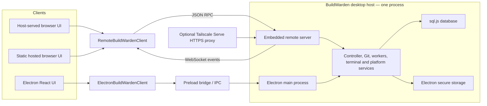

# BuildWarden

BuildWarden is yet another GUI for coding agents. In comparison to most others, it also focuses on project management, not just agent runs. Also separated are standalone chats without any linked repository. BuildWarden keeps projects, runs, chats, worktrees, branches, review activity, provider configuration, and local app state coordinated through a typed client boundary for both Electron IPC and optional browser RPC access.

## What It Does

- Add and manage multiple local Git projects.
- Start agent runs in `code`, `plan`, or `ask` mode against either a dedicated Git worktree or the local repository.
- Keep one workspace context per run, stream agent activity into the UI, and preserve reviewable diffs.
- Continue runs, undo a run to the last prompt, resume from saved checkpoints, and recover interrupted provider sessions where supported.
- Review run changes with activity, diff, terminal, in-app browser, and notes panels.
- Commit run worktree changes, publish branches, create local branches, and create GitHub pull requests or GitLab merge requests.
- Run standalone chats with history, follow-ups, file attachments, and generated file attachments from supported providers.
- Bookmark both runs and chats, and move runs into a project-level "For Later" view.
- Manage project branches, project task prompts, AI-generated project insights, and Project Lab implementation/RFC threads.
- Inspect and review GitHub pull requests or GitLab merge requests from a project, including diffs, activity, review comments, replies, approvals, and thread resolution.
- Configure integrated skills globally and per project.
- Store provider keys, PR/MR tokens, and proxy passwords through Electron secure storage.
- Support shell approvals, user-input requests, shell allowlists, per-run token accounting, and optional provider request/response logging.
- Optionally use the same BuildWarden UI from a browser through an authenticated, self-hosted remote-access endpoint.

## Remote Access

Remote Access is optional and disabled by default. When enabled, the BuildWarden desktop app starts an embedded server on `http://127.0.0.1:47831`. The server hosts the browser build of the same React application used by Electron and exposes typed JSON RPC plus WebSocket event streams to that application.

The server deliberately listens only on loopback. It cannot be reached directly through the host's LAN address, such as `http://192.168.x.x:47831`. To connect from another computer, tablet, or phone, use the optional Tailscale Serve integration. BuildWarden remains the host and sole owner of its database, Git operations, workers, and terminals; no data is moved to a central BuildWarden service.

BuildWarden also provides a static client in `apps/web` for deployment at one stable Vercel or other static-hosting URL. The production client is available at [https://buildwarden-app.vercel.app](https://buildwarden-app.vercel.app/), but using it is optional: users can host the static build on any web server and domain they choose. A self-hosted deployment must use HTTPS, serve the SPA fallback, and be added as an exact origin under **Hosted website origins** in BuildWarden. These deployments contain no backend or relay: the browser still connects directly to the user's desktop through Tailscale. The existing host-served URL continues to work independently.

### Requirements

Install Tailscale using its [platform installation guide](https://tailscale.com/docs/install). Tailscale Serve requires HTTPS certificates to be enabled for the tailnet and remains subject to the tailnet's access-control policy; see the [Tailscale Serve documentation](https://tailscale.com/docs/features/tailscale-serve).

BuildWarden looks for `tailscale` on `PATH` and in the standard Windows, macOS, and Linux installation locations. A custom executable can be supplied through `TAILSCALE_CLI_PATH` before starting BuildWarden.

### Set Up Remote Access

1. Start the BuildWarden desktop app on the computer that owns the projects and runs the agents.
2. Open **Settings → Network → Remote access** and enable **Remote Access**.
3. For a browser on the same computer, open the displayed loopback URL, normally `http://127.0.0.1:47831`.
4. For another tailnet device, enable **Expose to tailnet**. BuildWarden verifies Tailscale, creates a background HTTPS Serve proxy to its loopback server, and displays the MagicDNS URL, normally `https://<device>.<tailnet>.ts.net/`.
5. Choose whether the new session should be read-only or whether **Allow runs, chats, approvals, Git, projects, and terminal** should grant control scopes.
6. Select **Create pairing code**, then open the pairing link, scan its QR code, or enter the code in the browser.

For the hosted website, open [https://buildwarden-app.vercel.app](https://buildwarden-app.vercel.app/), add the exact origin `https://buildwarden-app.vercel.app` under **Hosted website origins**, choose **Hosted website** when creating the code, and scan the resulting QR link. To deploy another instance, build `apps/web` as described in its README and configure that deployment's exact HTTPS origin instead. Hosted sessions use an origin-bound bearer stored in IndexedDB; host-served sessions continue to use the HttpOnly cookie described below.

Pairing codes expire after five minutes and can be used only once. A successful pairing creates a revocable device session that is valid for up to 90 days. The host-served browser keeps its session token in an `HttpOnly`, `SameSite=Strict` cookie, not in `localStorage`; the cookie is marked `Secure` when the connection uses Tailscale HTTPS. The separately hosted client stores its origin-bound bearer in IndexedDB. Use **Disconnect** in the browser to revoke its current session, or revoke any paired device from the desktop settings.

The desktop app must be running for the website, RPC operations, and live events to work. Tailscale's background Serve configuration can survive restarts, but it only proxies to BuildWarden while BuildWarden's embedded loopback server is running. Disabling Remote Access stops the server and removes only the exact Tailscale Serve root handler that BuildWarden created; unrelated Serve configuration is left unchanged.

If automatic Tailscale setup is unavailable, the settings page shows the exact command for the current port. The default equivalent is:

```bash
tailscale serve --bg --yes --https=443 --set-path=/ http://127.0.0.1:47831
```

BuildWarden refuses to replace an existing root HTTPS handler and reports the conflict instead. Useful diagnostics are `tailscale status` and `tailscale serve status`.

## Architecture

BuildWarden has one authoritative host and two client transports. The Electron renderer uses the preload IPC bridge, while the browser uses authenticated HTTP RPC and WebSocket streams. Both clients render the same React components through the `BuildWardenClient` interface and capability flags.




- `apps/desktop`
  - Electron main process: authoritative app controller, IPC handlers, remote-server lifecycle, run/chat orchestration, workers, host terminal service, Tailscale Serve integration, notifications, and secret-store integration.
  - Preload: safe desktop bridge exposed as `window.buildwarden` and wrapped by `ElectronBuildWardenClient`.
  - Thin Electron renderer entry that supplies `ElectronBuildWardenClient` to the shared UI.
- `apps/web`
  - Hosted and embedded browser entries, pairing/session lifecycle, IndexedDB connection persistence, Vite build, and self-contained Vercel configuration.
  - Produces both the static Vercel site and `apps/desktop/out/web` used by the embedded server.
- `packages/renderer`
  - Shared React application, components, styles, assets, capability-aware UI, and Electron/remote client adapters consumed by both app entries.
- `packages/remote-server`
  - Loopback-only HTTP server, static web application hosting, protocol/version negotiation, scoped RPC dispatch, one-time pairing and session authentication, request validation, idempotency enforcement, and authenticated WebSocket event streaming.
- `packages/shared`
  - Shared types, DTOs, IPC and remote RPC contract shapes, protocol constants, provider metadata, settings keys, run/chat/event contracts, project insight types, and integrated skill metadata.
- `packages/db`
  - Local persisted state using `sql.js`.
  - Projects, provider accounts, models, runs, run steps, run notes, worktrees, bookmarks, chats, chat steps, chat bookmarks, project tasks, project insights, Project Lab threads/events, provider session runtime, settings, snapshots, checkpoint metadata, remote pairing grants, device sessions, idempotency records, and security audits.
- `packages/git-service`
  - Repository validation, worktree lifecycle, branch management, diff computation, GitHub/GitLab remote parsing, PR/MR diff fetching, branch publishing, and pull/merge request creation helpers.
- `packages/agent-runtime`
  - Runtime execution primitives, run registry, event normalization, status persistence, and streaming adapter glue.
- `packages/provider-ai-sdk`
  - Unified AI SDK provider and harness for OpenAI, Anthropic, Google, xAI, and OpenAI-compatible endpoints.
- `packages/provider-azure-legacy`
  - Azure Legacy Provider client and harness for Azure/OpenAI-style Chat Completions flows.
- `packages/provider-codex-cli`
  - Codex CLI app-server provider and harness, including local session resume, shell approval/user-input bridging, and Codex-oriented model helpers.
- `packages/provider-claude-code`
  - Claude Code provider and harness using the local `claude` CLI.
- `packages/provider-cursor-agent`
  - Cursor Agent provider and harness using the local `agent acp` CLI flow.

## Providers

BuildWarden currently models provider accounts with these provider types:

- `ai-sdk`
- `azure-legacy`
- `codex-cli`
- `claude-code`
- `cursor-agent`

The AI SDK provider can be configured for OpenAI, Anthropic, Google, xAI, or OpenAI-compatible endpoints. Codex CLI, Claude Code, and Cursor Agent use local CLI installations and local session state. Provider configuration and auth stay separate from runtime execution so the app can share run/chat orchestration while keeping provider-specific behavior isolated.

### Local Provider And Full Computer Usage

To use a local provider and give BuildWarden full access to the computer, install at least one of these tools/CLIs on the PC:

- [Codex CLI](https://learn.chatgpt.com/docs/codex/cli)
- [Claude Code](https://code.claude.com/docs/en/quickstart#step-1-install-claude-code)
- [Cursor CLI](https://cursor.com/de/cli)

A local provider is optional. If none of these tools is installed, any supported API key can still be used through the Vercel AI SDK provider.

## Git, Worktrees, And Review

- Project repositories are user-owned and must not be confused with BuildWarden-created worktrees.
- A run can use a dedicated worktree branch or operate in the local repository, depending on `workspaceType`.
- Worktree diffs include staged, unstaged, and untracked changes where possible.
- Run workspaces can be opened in configured IDEs, an embedded terminal, a system terminal, or the file manager.
- Branch management supports fetch, checkout, create, rename, delete, pull, and push operations.
- Pull/merge request publishing uses `gh` or `glab` when available, with provider web draft URLs as a fallback.
- Project PR/MR review supports GitHub and GitLab remotes with project-scoped API tokens stored in the secret store.

## Development

From the repo root:

```bash
pnpm install
pnpm dev
```

The packaged build always includes the browser application. When testing Remote Access with the development app, build the static web assets before starting Electron and rebuild them after renderer changes:

```bash
pnpm --filter @buildwarden/web build:embedded
pnpm dev
```

Useful validation commands:

```bash
pnpm typecheck
pnpm lint
pnpm test
pnpm --filter @buildwarden/desktop build
```

Packaging shortcuts:

```bash
pnpm build:win
pnpm build:win:portable
pnpm build:linux
pnpm build:linux:appimage
pnpm build:linux:deb
pnpm build:mac
pnpm build:all
```

## Notes

- The workspace is a `pnpm` monorepo with packages under `apps/*` and `packages/*`.
- Secrets are stored through Electron `safeStorage` when available and must not be written to SQLite as plaintext.
- The embedded terminal uses `node-pty`; if it is unavailable, terminal support is disabled with a user-facing setup hint.
- `electron-builder` is configured with `npmRebuild: false`; native module setup should be handled during dependency installation, not during packaging.
- `pnpm lint` runs the desktop ESLint task and the desktop Vitest suite through the root script.
- Some run/chat state survives app restarts through DB rows, checkpoints, and provider session runtime records.
- Shared renderer components use `BuildWardenClient`; its Electron adapter wraps `window.buildwarden`, while its browser adapter uses authenticated RPC. Privileged filesystem, Git, shell, and secret-store logic remains in the Electron main process.

## Contributing

Keep changes small, typed, and aligned across the Electron boundary. When changing shared app behavior, update shared contracts, DB snapshot/persistence shape, main IPC/controller logic, preload exposure, and renderer consumers together. For UI work, preserve BuildWarden's dense developer-tool layout and avoid spending vertical space without a clear workflow benefit.
